# 🏗️ System Architecture & Engine Hierarchy
## The Definitive Operational Blueprint for the YouTube Production Machine

---

## 1. Executive Architecture Overview

The entire production ecosystem is structured as a **modular, multi-tiered hierarchy**. Every skill and tool has a dedicated scope, strict boundary, and defined relationship to the others:

```mermaid
flowchart TD
    ROOT["🎬 YouTube Production Machine (Root)"]
    
    %% Core Pillars
    ROOT --> P1["🔬 1. Research & Fact-Check Engine"]
    ROOT --> P2["✍️ 2. Scriptwriting & Packaging Engine\n(youtube-content-machine)"]
    ROOT --> P3["🎥 3. B-Roll & Visual Production Engine\n(broll skill)"]
    
    %% Pillar 2 Details
    P2 --> P2A["Hook Attack Ladders & Misconception Maps"]
    P2 --> P2B["Script Voice Self-Audit Gate (7 Questions)"]
    P2 --> P2C["Retention Standing Rules (120s Payoff Rule)"]
    P2 --> P2D["Evergreen Packaging & Title/Thumbnail Locks"]
    
    %% Pillar 3 (broll) Sub-Engines
    P3 --> B1["✨ Track 1: Modern Motion Design & Modular Specs\n(Specs 1–8 — HIGHLY MIXABLE)"]
    P3 --> B2["📰 Track 2: Vox-Style Explainer System\n(vox-style — STRICTLY ISOLATED)"]
    P3 --> B3["🎞️ Track 3: OEM Video & Real B-Roll Ingestion\n(Plug-in Renewables Library)"]
    P3 --> B4["📱 Track 4: YouTube Shorts Viral Engine\n(9:16 Vertical 1080x1920)"]
    
    %% Track 1 Modular Specs
    B1 --> S1["Spec 1: ProductSpec (Hero, CAD, Callouts)"]
    B1 --> S2["Spec 2: RatingScore (Board, Multipliers)"]
    B1 --> S3["Spec 3: Comparison (Split Versus, Tradeoffs)"]
    B1 --> S4["Spec 4: MetricTelemetry (Meters, Gauges)"]
    B1 --> S5["Spec 5: QuoteReceipt (Forums, Evidence)"]
    B1 --> S6["Spec 6: StatementSpec (Lone Words, Punches)"]
    B1 --> S7["Spec 7: SequentialEmphasis (Lists, Locks)"]
    B1 --> S8["Spec 8: ForensicAudit (Pillars, Verdicts)"]
    
    %% Track 2 Vox Styles
    B2 --> V1["House Style 1: Newsroom Collage"]
    B2 --> V2["House Style 2: Mixed-Media Paper"]
    B2 --> V3["House Style 3: 3D Paper Diorama"]
    B2 --> V4["House Style 4: Detective Casefile (Murder Board) ⭐"]
    B2 --> V5["House Style 5: Polaroid Forensic Snapshot ⭐"]
    B2 --> V6["House Style 6: Tactical Cartography (Johnny Harris) ⭐"]
    
    %% Execution Layer
    P3 --> EXEC["⚙️ 4. Execution & Compositing Frameworks"]
    EXEC --> REM["Remotion (Deterministic Code Compositor &\nFrame-Accurate Acoustic Foley Mixing)"]
    EXEC --> FLOW["Google Flow / Omni Flash 1.1\n(Generative AI Diffusion Video)"]
    EXEC --> NLE["NLE Timeline (Premiere Pro / DaVinci Resolve\nMaster Timeline Assembly)"]
    
    style ROOT fill:#1A1B1E,stroke:#3E7BFA,stroke-width:3px,color:#fff
    style P3 fill:#1E2738,stroke:#10B981,stroke-width:2px,color:#fff
    style B1 fill:#151C28,stroke:#FFB300,stroke-width:2px,color:#fff
    style B2 fill:#151C28,stroke:#EF4444,stroke-width:2px,color:#fff
    style REM fill:#0F141C,stroke:#38BDF8,stroke-width:2px,color:#fff
```

---

## 2. The Core Production Pillars

### Pillar 1: Research & Fact-Check Engine
- **Scope**: Technical deep-dives, hardware teardown reviews, and community evidence harvesting.
- **Key Functions**:
  - Reconciles manufacturer marketing claims against independent lab benchmarks.
  - Harvests real owner failure patterns from community forums (Reddit, German Photovoltaikforum).
  - Enforces the **Fact-Check Gate** (`references/fact-check.md`) before scripting begins: extracts claims, assigns risk levels (✅ / ⚠️ / ❌), and corrects technical discrepancies.

---

### Pillar 2: Scriptwriting & Packaging Engine (`youtube-content-machine`)
- **Skill Location**: [`skills/youtube-content-machine/SKILL.md`](file:///C:/Users/user/OneDrive/Documents/antigravity-youtube-scrpt-machine-main/antigravity-youtube-scrpt-machine-main/skills/youtube-content-machine/SKILL.md)
- **Scope**: Transforming raw topic concepts into retention-engineered YouTube scripts and packaging.
- **Key Functions & Mandatory Gates**:
  1. **Misconception Mapping**: Identifies the viewer's intuitive false assumption and attacks it in the hook.
  2. **Opening Attack Ladder**: Compresses hook, stakes, and thesis into the first 30 seconds.
  3. **Script Voice Self-Audit Gate**: 7-question verification (hook, chronological escalation, scene test, re-hook test, forbidden moves, ending, human voice).
  4. **The 120-Second Payoff Rule**: First scored category and comparison graphic must appear within 90–120 seconds.
  5. **Evergreen Packaging**: Titles with zero year stamps, curiosity-driven thumbnail concepts, and SEO metadata.

---

### Pillar 3: B-Roll & Visual Production Engine (`broll` skill)
- **Skill Location**: [`C:\Users\user\.gemini\config\skills\broll\SKILL.md`](file:///C:/Users/user/.gemini/config/skills/broll/SKILL.md)
- **Scope**: Translating script paragraphs into broadcast-grade visual assets and motion design clips.
- **Architectural Segregation**: The engine houses **4 distinct production tracks**, governed by a strict rule of **Mixability vs. Isolation**.

---

## 3. Deep Dive into Pillar 3 (`broll`): The 4 Visual Production Tracks

### Track 1: Modern Motion Design & Modular Specs (Specs 1–8)
> **THE GOLDEN RULE: HIGHLY MIXABLE & FLUID**  
> Modern motion design is built on modularity. You can fluidly transition, cross-pollinate, and chain different specs together within a single scene or across a paragraph.

- **Visual Tone**: Crisp Keynote studio, Swiss-editorial typography, dark slate backgrounds (`#080B10`), sleek glowing accent lines, precision HUD telemetry, and tactile contact shadows.
- **The 8 Reusable Modular Specs**:
  1. **Spec 1: `ProductSpec`**: Keynote hardware hero reveals, exploded CAD schematics, and dimension callouts.
  2. **Spec 2: `RatingScore`**: Broadcaster-style scoreboards, category weighting multipliers (`×2`), and score badges.
  3. **Spec 3: `Comparison`**: Conceptual split-screen versus, trade-off comparisons (e.g. Code vs. Recall).
  4. **Spec 4: `MetricTelemetry`**: Spatial multi-scene choreography, live animated decibel VU meters, thermal gauges, and acoustic discrepancy trackers.
  5. **Spec 5: `QuoteReceipt`**: Dark-mode community evidence cards (Reddit/forums) with inline felt-tip highlighters.
  6. **Spec 6: `StatementSpec`**: High-impact editorial thesis hooks, lone words, and massive numerical stat punches (£1,000+).
  7. **Spec 7: `SequentialEmphasis`**: Comma-separated symptom lists, progressive multi-beat locks, and mechanical checkmarks.
  8. **Spec 8: `ForensicAudit`**: Dense multi-pillar criteria rows, mechanical clicks, and final verdict stamps.
- **How They Blend**: A single 12-second B-roll can open on Spec 6 (lone word punch), glide into Spec 1 (hardware cutout), and finish on Spec 4 (live telemetry meter).

---

### Track 2: The Vox-Style Explainer System (`vox-style`)
> **THE GOLDEN RULE: STRICTLY ISOLATED & NON-MIXABLE**  
> When a scene or video is designated "Vox style", you **NEVER mix it with modern glossy Keynote boxes, neon HUDs, or Swiss-modern cards**. It must strictly maintain its tactile, archival, investigative documentary identity.

- **Skill Location**: [`C:\Users\user\.gemini\config\skills\vox-style\SKILL.md`](file:///C:/Users/user/.gemini/config/skills/vox-style/SKILL.md)
- **Visual Tone**: Archival newsprint, desaturated tactile palette, hot red accent (`#D62E1F`), mustard secondary (`#D9A441`), physical paper diorama layers, halftone dot matrices, rough white keylines, and mechanical drafting tools.
- **The 6 Locked House Styles & Documentary Directions**:
  1. **Newsroom Collage (Default)**: Aged newsprint (`#F4EFEA`), halftone black-and-white cutouts with rough white borders and offset red strokes, giant stat numerals treated as physical characters, and print grain.
  2. **Mixed-Media Paper**: Bold solid color blocks, archival photographic cutouts, black felt-tip marker circles, and high-contrast geometric paper shapes.
  3. **3D Paper Diorama**: Deep sepia craft paper and heavy textured cardboard, layers separated in physical space, censor bars, letterpress props, and deep cinematic depth-of-field.
  4. **Detective Casefile (Murder Board)**: Dark corkboard (`#2E1F16`), taut red yarn linking pushpins between suspect products and lab benchmarks, manila evidence folders with `[CLASSIFIED]` stamps, typewriter text, and fingerprint graphite smudges.
  5. **Polaroid Forensic Snapshot**: Authentic white chemical Polaroid 600 frames with wide chins, handwritten black Sharpie notes, chemical developing emulsion bloom (dark to full exposure), scotch tape, and paperclip clusters. Ideal for field reportage and high-impact scene openers.
  6. **Tactical Cartography (Johnny Harris Map)**: Tilted 3D topographic contour blueprints, animated red route trajectories, glowing amber GPS pins, coordinate crosshairs (`48°51'24"N 2°17'48"E`), and torn paper revealing satellite terrain.
- **Dual Execution Pathways**:
  - **Generative Video Prompts (Google Flow / Omni Flash 1.1)**: Structured 5-line prompts (`STYLE REFERENCE`, `SCENE`, `MOTION`, `AUDIO`, `NEGATIVE`) with 3 physical depths (BG/MG/FG) and diegetic Foley sound design (NO voiceover, NO music).
  - **Deterministic Remotion Engine**: Code-based rendering using `Halftone` dot overlays, `TearReveal` paper rips, `AlertWash` color floods, and `VoxStamp` rubber letterpress stamps.

---

### Track 3: OEM Video & Real-World B-Roll Ingestion
- **Asset Library**: [`C:\Users\user\Downloads\Plug-in Renewables\`](file:///C:/Users/user/Downloads/Plug-in%20Renewables/)
- **Scope**: Ingesting pristine 1080p and 4K official manufacturer footage, real balcony installation documentaries, and teardowns.
- **The 3 Non-Negotiable Operating Rules**:
  1. **Zero Overlay on Baked-in Text (Collision Avoidance)**: Never place motion graphics or telemetry over baked-in specs or manufacturer titles. Position graphics strictly in clean negative space.
  2. **The "Premiere Pro Crop"**: Automatically scale up `115%–125%` and push `translateY(-35px)` to crop out foreign review subtitles, captions, or watermarks.
  3. **Rapid Punch-In to Full Bleed**: Expand from a focal card to the full 1920x1080 canvas within 8–15 frames using a snappy spring.

---

### Track 4: YouTube Shorts Viral Engine
- **Skill Location**: [`C:\Users\user\.gemini\config\skills\youtube-shorts-viral-engine\SKILL.md`](file:///C:/Users/user/.gemini/config/skills/youtube-shorts-viral-engine/SKILL.md)
- **Scope**: Dedicated vertical 9:16 (1080x1920) automated production engine.
- **Features**: Hybrid 70% zoom framing, Microsoft Edge TTS Andrew neural voiceover, optical-center kinetic subtitles, anti-watermark asset curation, and immediate product hook architecture.

---

## 4. Execution & Compositing Frameworks (Where Things Get Built)

| Tool / Framework | Primary Role in the Pipeline | Why It Is Used |
| :--- | :--- | :--- |
| **Remotion** ([`antigravity-solar-remotion`](file:///C:/Users/user/OneDrive/Documents/antigravity-solar-remotion)) | **Code-Based Video Compositor & Sequencer** | Deterministic frame accuracy, animated telemetry data/meters, live scoreboard multipliers, forensic comparison rows, and 100% credit-free rendering directly into `motion_clips/`. |
| **Google Flow / Omni Flash 1.1** | **Generative AI Video Diffusion** | Produces organic, photorealistic camera moves, complex physical fluid dynamics, or cinematic video clips where hand-coded motion graphics would look sterile. |
| **Premiere Pro / DaVinci Resolve** | **Master NLE Editing Timeline** | Final assembly: Places the full 15-minute voiceover on Track A1, and layers rendered B-roll clips from `motion_clips/` across Tracks V1/V2 over the edit points. |

---

## 5. Universal System Laws & Guardrails

1. **Strict Vocal Chronology**: The audio dictates what appears on screen at every exact second. Visuals arrive word-by-word with the vocal cadence. Never spoil future beats prematurely, and never lag behind.
2. **Authentic Sourcing Law**: Never replace real-world architectural landmarks, venues, or hardware units with synthetic vector line drawings. Extract clean photographic transparent cutouts from the web.
3. **Script-Proportional Asset Harvesting**: Sourcing depth must match the script's narrative scope. For teardowns, benchmarks, and reviews, assemble a comprehensive visual library into `product_images/<brand>/`.
4. **The "Full Canvas" Trap**: Never open a scene at frame 0 with pre-assembled layouts. Every product, metric, or clause gets its own isolated entrance and Foley punch.
5. **Mandatory Sound Design**: Sound design is a first-class citizen across both engines—diegetic acoustic physical Foley in generative prompts, and frame-accurate `.wav` hits in Remotion code.
6. **Windows Execution Mandate**: Always execute Remotion commands via `cmd /c npx remotion render ...`.
